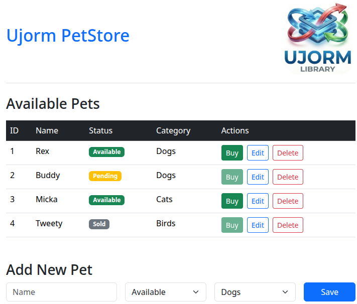

# Ujorm PetStore

Ujorm PetStore is a practical showcase of a web application built on **Spring Boot 3.5** and **Ujorm 3**.
The project serves as an inspiration for developing web applications with an emphasis on straightforwardness, maximum type safety, and zero hidden "magic".

Just pure Java, full control over generated SQL, and HTML rendered safely straight from the code.



---

## Key Features & Modules

The application demonstrates the power of two core Ujorm3 modules that streamline development by eliminating common abstractions:

### 1. Database Access (ujo-orm)
* **Immutable Records:** Uses modern Java `record`s as domain objects (`Pet`, `Category`), ensuring clean code and absolute immutability while maintaining compatibility with `@Table` and `@Column` annotations.
* **Type-Safe SQL Builder:** An annotation processor generates metamodels (e.g., `MetaPet`) at compile-time. This eliminates typos in column names and allows the compiler to catch errors before the app even runs.
* **SQL Transparency:** Unlike heavy JPA frameworks, there are no `LazyInitializationException` or hidden N+1 issues. You have full control over the `SqlQuery`.
* **The Mapping Advantage:** Ujorm bridges the gap between raw SQL and object mapping. You can write native SQL and easily map results to Java records using the `label()` method, keeping the SQL debuggable in any DB client.

### 2. UI Creation (ujo-web)
* **Pure Java HTML Rendering:** Replaces traditional engines like Thymeleaf or JSP. HTML is rendered directly from Java using the `HtmlElement` builder and `try-with-resources` blocks.
* **Refactoring Power:** Since the UI is just Java code, you get full IDE support. Complex UI blocks can be instantly refactored into smaller, reusable methods (e.g., `renderTable()`) without the overhead of fragment files or context passing.
* **Type Safety:** The page structure is verified at compile-time. No more runtime errors caused by a typo in a template variable.

### 3. Safe Request Handling
* **HttpParameter Interface:** Uses `enum` implementations to centralize web parameter definitions, protecting the application from mapping errors or form-name typos.

---

## Tech Stack

* **Java:** 25
* **Framework:** Spring Boot 3.5.0 (Web, JDBC)
* **ORM and Web:** Ujorm 3.0.0-SNAPSHOT (`ujo-orm`, `ujo-web`)
* **Database:** H2 (In-memory)
* **UI Styling:** Bootstrap 5.3.3 (CDN)

## Project Structure

* `AppPetStore.java` – Main Spring Boot class and transactional service layer.
* `Dao.java` – Data access layer integrating Spring JDBC with Ujorm `EntityManager`.
* `Entities.java` – Database schema definitions using Java records.
* `PetServlet.java` – A stateless Servlet acting as both Controller and View. It handles HTTP communication (PRG pattern) and builds the HTML.
* `Constants.java` – Shared enums (`Status`) and CSS classes.

## How to Run the Project

1. Ensure you have **JDK 25** and **Maven** installed.
2. Run in the root directory:
3. 
   ```bash
   mvn spring-boot:run
   ```
3. Open your browser at: [http://localhost:8080](http://localhost:8080)

---

## Conclusion: Why this approach?

This "rebellious" architecture is ideal for developers seeking a simpler alternative to heavy JPA or complex SPA frontends.

* **Use Cases:** Perfect for microservices, B2B tools, internal apps, or HTMX-driven projects where productivity and maintainability are priorities.
* **The "Java-First" Philosophy:** By keeping everything (SQL mapping, UI structure, Logic) within the Java compiler's reach, you minimize context switching and maximize reliability.

**Alternative Comparison:**
* **ORM:** MyBatis, Jdbi, Spring Data JDBC.
* **Web:** j2html, Wicket, Vaadin.