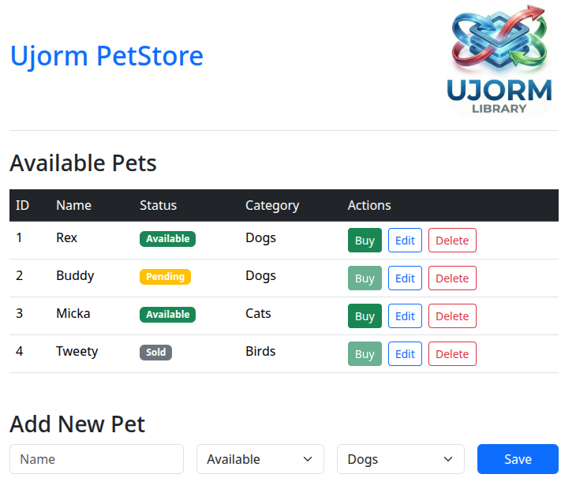

# Ujorm PetStore

Ujorm PetStore is a practical showcase of a web application built on **Avaje Inject** and
[**Ujorm 3**](https://github.com/pponec/ujorm/tree/ujorm3?tab=readme-ov-file#-ujorm3-library).
The project serves as an inspiration for developing web applications with an emphasis on straightforwardness, maximum type safety, and zero hidden "magic".

Just pure Java, full control over generated SQL, compile-time dependency injection, and HTML rendered safely straight from the code.



---

## Dependencies & Footprint

The project is designed with an extreme focus on minimalism and zero bloat. The dependency tree consists only of essential, lightweight libraries:

* **Avaje Inject:** Compile-time dependency injection with no runtime reflection overhead.
* **HikariCP:** Lightning-fast database connection pooling.
* **Ujorm:** (`ujo-core`, `ujo-orm`, `ujo-web`) for database operations and HTML rendering.
* **Jakarta APIs:** (`jakarta.inject`, `jakarta.persistence`, `jakarta.servlet`) for standardized interfaces.

Because of this lean architecture, the application has an incredibly small memory and storage footprint. 
If you configure the H2 database (or any other database driver) as a `provided` dependency so that it is supplied by the application server (e.g., Tomcat or Jetty), the total size of the compiled `WAR` file shrinks to a mere **~850 KB** (869,458 bytes).

That still works, although `JdbcProvider` now names the H2 `DataSource` in the source code: the
native build needs the driver wired statically, and a `provided` dependency stays on the compile
class path. The embedded Jetty is `provided` for the same reason — it is linked into the native
binary, never packaged into the WAR.

---

## Key Features & Modules

The application demonstrates the power of Ujorm3 modules combined with modern compile-time DI, streamlining development by eliminating common abstractions:

### 1. Database Access (ujo-orm)
* **Immutable Records:** Uses modern Java `record`s as domain objects (`Pet`, `Category`), ensuring clean code and absolute immutability while maintaining compatibility with `@Table` and `@Column` annotations.
* **Type-Safe SQL Builder:** An annotation processor generates metamodels (e.g., `QPet`) at compile-time. This eliminates typos in column names and allows the compiler to catch errors before the app even runs.
* **SQL Transparency:** Unlike heavy JPA frameworks, there are no `LazyInitializationException` or hidden N+1 issues. You have full control over the `SelectQuery`.
* **The Mapping Advantage:** Ujorm bridges the gap between raw SQL and object mapping. You can write native SQL and easily map results to Java records, keeping the SQL debuggable in any DB client.
* **No Runtime Compilation:** The `DomainHandler` classes, which Ujorm normally generates and compiles
  on the first use of an entity, are pre-built during the Maven `process-classes` phase by
  `org.ujorm.core.generator.HandlerPrecompiler` (see the `exec-maven-plugin` block in [pom.xml](pom.xml)).
  The entity list comes from the `META-INF/ujorm/entities.lst` index written by the Ujorm annotation
  processor. The application therefore starts on a plain **JRE** with no Java compiler, and the
  Jetty plugin no longer needs the Ujorm jars on its own class path.

### 2. UI Creation (ujo-web)
* **Pure Java HTML Rendering:** Replaces traditional engines like Thymeleaf or JSP. HTML is rendered directly from Java using the `HtmlElement` builder and `try-with-resources` blocks.
* **Refactoring Power:** Since the UI is just Java code, you get full IDE support. Complex UI blocks can be instantly refactored into smaller, reusable methods (e.g., `renderTable()`) without the overhead of fragment files or context passing.
* **Type Safety:** The page structure is verified at compile-time. No more runtime errors caused by a typo in a template variable.

### 3. Safe Request Handling
* **HttpParameter Interface:** Uses `enum` implementations to centralize web parameter definitions, protecting the application from mapping errors or form-name typos.

### 4. Declarative Transactions (`@Transactional`)

Transaction boundaries are declared **at the service level** with a custom
[`@Transactional`](src/main/java/org/ujorm/petstore/utilities/Transactional.java) annotation —
the same mental model as **Spring Boot** — instead of implicitly wrapping every incoming HTTP
request. A transaction is opened because a *business method* is invoked, not because a new HTTP
session arrived, so the service layer works the same whether it is called from a servlet, a
scheduled job, a test, or a message consumer.

```java
@Transactional(readOnly = true)
public List<Pet> getPets() { ... }      // SELECT in a read-only transaction

@Transactional
public PetOrder buyPet(Long petId) {     // UPDATE + INSERT, committed on success,
    ...                                  // rolled back on any exception
}
```

**How it works** — the annotation is meta-annotated with Avaje's `@Aspect`, so the
`avaje-inject-generator` weaves a proxy **at compile time** (no runtime reflection). Each
intercepted call is routed through
[`TransactionalAspect`](src/main/java/org/ujorm/petstore/utilities/TransactionalAspect.java)
into [`TransactionManager`](src/main/java/org/ujorm/petstore/utilities/TransactionManager.java),
which opens a JDBC `Connection`, binds it to the current thread, and commits or rolls back
around the method. The service methods themselves stay free of transaction boilerplate.

* **Propagation `REQUIRED`** — a `@Transactional` method invoked from within an active
  transaction joins it (one commit at the outermost boundary).
* **`readOnly` hint** — read methods flag the connection read-only, documenting intent and
  letting the driver/pool optimise.
* **Proxy semantics** — exactly like Spring, the aspect only fires when the bean is called
  *through its proxy*; an internal `this.method()` self-invocation does not start a new
  transaction (it simply reuses the surrounding one).

> The alternative, *programmatic* style (injecting `TransactionManager` and wrapping bodies in
> `tm.run(() -> { ... })`) is still available for cases that need fine-grained, imperative control.

### 5. Native Executable (GraalVM)

The whole application compiles into a **single self-contained Linux binary** — the embedded
Jetty, the H2 database and Ujorm linked in. It needs no JVM, no application server and no
GraalVM on the host: the build runs inside a Docker image.

```bash
./run-ujorm-petstore-native.sh              # build the binary and start it
./run-ujorm-petstore-native.sh --build-only # build only
```

Docker is the only requirement; the JVM way of running the project keeps its own script and its
own JDK requirement, see [How to Run the Project](#how-to-run-the-project).

Measured on Ubuntu 24.04, the very same `Main` class in both columns:

| | Native binary | JVM | Ratio |
|---|---|---|---|
| First response after start | **33.5 ms** | 701.5 ms | **21×** |
| Resident memory | **50 MB** | 190 MB | 3.8× |
| Artifact | 55 MB binary | 3.4 MB WAR + a JVM | — |

The binary really is standalone — copied alone into an empty directory it still serves every page
and the static images, with no shared library beside it.

##### How the start-up figure was taken

The clock runs from launching the process to the **first successful `GET /`** — so it covers Jetty
coming up, the Avaje container being built, the connection pool opening, H2 creating the schema and
seeding it, and the page being rendered from a real SQL query. Not "the process is alive".

Both columns run `org.ujorm.petstore.Main` from the same class path, so this compares a JVM against
native code, not a WAR against a binary. The readiness loop is plain bash over `/dev/tcp` rather
than a `curl` loop, because spawning a process per attempt would distort a 33 ms measurement by
more than ten per cent. Nine samples per series, three series, the first one discarded as a warm-up;
the two that count agreed within 3 %, and the table shows their averaged medians. Hardware: Ubuntu
24.04, JDK 25, GraalVM CE 25.0.2.

Tuning the JVM for start-up narrows the gap but does not close it: `-XX:TieredStopAtLevel=1`, which
keeps the C1 compiler and skips the expensive C2 profiling, brings the JVM to 582 ms — still **17×**
slower. The distance is not a misconfiguration. It is the virtual machine starting, loading and
verifying classes, and interpreting bytecode before it ever reaches the application.

#### Why Ujorm can do this at all

Ujorm generates a `DomainHandler` for an entity and **compiles it at runtime**, on the first use of
that entity. That needs `javax.tools.JavaCompiler`, which a native image does not have — and
neither does a plain JRE. `HandlerPrecompiler` builds the very same classes during the Maven
`process-classes` phase instead, from the `META-INF/ujorm/entities.lst` index written by the Ujorm
annotation processor. Nothing is compiled at runtime any more, and the ORM notices no difference:
the pre-compiler walks the identical code path the runtime would have walked.

#### The application code is not modified

The WAR deployment discovers `Bootstrap` and the servlets by scanning the `@WebListener` and
`@WebServlet` annotations. A native image cannot scan anything at runtime, so
[`Main.java`](src/main/java/org/ujorm/petstore/Main.java) registers the very same components
programmatically — reading the URL patterns from `Constants.Url`, the same constants the
annotations use. `PetServlet`, `InfoServlet`, `AbstractServlet` and `Bootstrap` are untouched.

Both entry points were verified to render **byte-identical pages**, and the served logo has the
same MD5 as the file in the sources.

#### Choosing the container: Tomcat lost the measurement

Embedded Tomcat looked like the safer bet, because Spring Boot builds native images with it every
day. A hello-world spike said otherwise. Both containers needed exactly two manual hints and
neither required the tracing agent, but:

| | Tomcat 11 | Jetty 12 ee10 |
|---|---|---|
| Binary | 42.5 MB | **23.8 MB** |
| Resident memory | 44.8 MB | **28.4 MB** |
| Startup | 30 ms | 28 ms |

Tomcat pulls `java.xml`, `java.management`, `java.rmi` and `java.naming` in for its JMX layer, and
it has to be told `Registry.disableRegistry()` or it dies while loading `mbeans-descriptors.xml`
reflectively. Jetty also matches the container this project already uses for development, so the
two Jetty versions are bound to a single `${jetty.version}` property.

#### The four things that broke, and why

Every one of them is a case of the image analysis not being able to see through a runtime lookup.
The metadata that fixes them lives in `src/main/resources/META-INF/native-image/`, each entry
carrying the reason it exists.

**1. HikariCP was handed an empty configuration.** `HikariConfig.copyStateTo()` moves the whole
configuration through `getDeclaredFields()`. Unregistered, that call returns an empty array, so the
pool is built from a blank configuration and dies on a bare `NullPointerException` with no message
and no useful frame. This one is worth remembering — it looks like a driver problem and is not.

**2. `DriverManager` is frozen at build time.** Its driver registry is captured while the image is
being built, so a JDBC URL resolves to nothing at runtime. `JdbcProvider` therefore hands the pool
a ready `org.h2.jdbcx.JdbcDataSource` instead of a URL. Wiring the driver statically also cut
26 MB off the binary, because the `DriverManager` path dragged H2's AWT-dependent tooling in.

**3. Static resources returned 404.** Registering the image files was not enough — Jetty resolves
its base resource as a *class loader directory*, so the resource pattern has to match the directory
entries as well.

**4. `ServletBridge` in ujo-web looks methods up by name** on the concrete request and response
implementation, which no static analysis can follow. This is the nastiest of the four, because it
fails **neither at build time nor at startup**: the server answers HTTP 200 and the failure hides
in the response body. That is why the acceptance test compares page content, never status codes.

#### Two passengers that were thrown out

The first build produced a 72 MB binary with six shared libraries beside it. Both surprises were
found by asking the image builder for its reachability graph:

```bash
native-image ... -H:+PrintAnalysisCallTree -H:PrintAnalysisCallTreeType=CSV
```

**The Java compiler was linked into the image.** `jdk.compiler` was the second largest contributor
after `java.base`, 7.2 MB of code and 11 870 reachable methods — 16 % of everything in the image.
Two independent paths reach `ToolProvider.getSystemJavaCompiler()`: the Ujorm `ClassGenerator`,
which is the fallback for a handler that was not pre-compiled, and the H2 `SourceCompiler`, which
compiles user defined Java functions. Neither is ever taken here, but no static analysis can prove
that. A one-method substitution reports that no compiler is available — which is precisely what a
plain JRE does, and Ujorm already handles that answer. That removed 14 MB.

##### Why `javac` has no place in a native image

It is not merely unused weight — it **cannot work there at all**, so keeping it is strictly a loss:

* **A native image is a closed world.** Its set of classes is decided when the binary is built.
  Even if `javac` produced bytecode at runtime, there is no class loader that could define it, so
  every path leading to the compiler ends in a failure. Shipping it buys exactly nothing.
* **It is the largest single thing you can delete.** 7.2 MB of code and a sixth of all reachable
  methods, for a feature that can never run.
* **It widens the attack surface of a server binary.** A process that can turn text into executable
  code is a useful thing for an attacker to find. A web server has no reason to contain one.
* **It contradicts the reason for building natively.** The point of ahead-of-time compilation is
  that all the work happens during the build. Carrying a compiler into production says the opposite.

The lesson generalises: whenever a build report shows `jdk.compiler`, some library is holding a
`ToolProvider` reference behind a branch that is never taken. Look for a runtime code generator —
an ORM, a templating engine, an expression evaluator, a mocking library — and give it its
build-time alternative, then cut the branch.

**H2 asked for the AWT desktop.** The `java.desktop` module was in the image with roughly 2200
reachable methods, and it was nothing in this application: `java.awt.Desktop` was *registered*, not
called. The source turned out to be the `META-INF/native-image/reflect-config.json` that ships
inside the H2 jar, which registers `Desktop`, `SystemTray` and `TrayIcon` under the condition that
`org.h2.tools.Server` is reachable — and it is, through the AUTO_SERVER support in
`Database.startServer`. The build excludes that file and supplies the same 27 useful entries
without the three AWT ones. That removed the remaining 3 MB and all six shared libraries.

Two earlier guesses were wrong, and are worth recording so nobody repeats them: neither a wildcard
over `META-INF/services` nor H2's reflective `Server.openBrowser()` had anything to do with it.

#### What this build taught us about GraalVM

Notes that would have saved time, in the order they hurt:

* **Reachable is not the same as executed.** Everything that *could* be called is linked in, even
  behind a condition that is always false. Removing weight means proving a branch can never be
  taken and then cutting it, usually with a substitution.
* **A build that succeeds proves nothing.** Every failure in this project appeared at run time, not
  at build time, and one of them did not even appear then: the server answered HTTP 200 with a
  broken body. Acceptance tests must read content.
* **A missing registration produces a bare `NullPointerException`.** `getDeclaredFields()` returns
  an empty array instead of failing, so the damage surfaces far from its cause. When an object looks
  half-initialised for no reason, suspect reflection metadata before suspecting your own code.
* **Registration granularity is exact.** `allPublicConstructors` does not satisfy
  `getDeclaredConstructor()`. Register what the library actually calls, not what looks similar.
* **Resource patterns must match directories, not only files.** A library that resolves a class
  loader *directory* — Jetty's base resource, for instance — needs the directory entry itself.
* **Build-time state is frozen.** `DriverManager` captures its driver registry while the image is
  built, and the runtime never rescans. Wire such things statically instead of looking them up.
* **You inherit the metadata of your dependencies.** A jar can carry its own
  `META-INF/native-image` configuration written for someone else's use case — H2 registers the AWT
  tray icon. `--exclude-config` drops it; ship a filtered copy of the parts you need.
* **Measure, do not guess.** `-H:+PrintAnalysisCallTree` with `-H:PrintAnalysisCallTreeType=CSV`
  gives the whole reachability graph as three CSV files that a short script can query. Two plausible
  theories about the AWT dependency were wrong; the graph answered in minutes what reasoning did not.
* **Keep the GraalVM SDK off the image class path.** The substitution annotations come from
  `org.graalvm.sdk:nativeimage` in `provided` scope, and the builder refuses to see its own jars on
  the class path of the image it is building.
* **Put metadata where the builder looks for it.** Files under
  `META-INF/native-image/<group>/<artifact>/` on the class path are picked up automatically, so the
  build command needs no `-H:` options and the configuration travels with the sources.

#### Portability of the binary

The image is built on Oracle Linux with glibc 2.39 and linked dynamically, so it runs on Ubuntu
24.04 and anything newer. An older distribution would need a static build (`--static --libc=musl`),
which this project does not configure.

---

## Code Samples

The project is designed with an emphasis on straightforwardness.
The following example from a stateless servlet demonstrates how elegantly logic, parameters, and HTML generation can be connected:

```java
protected void doGet(HttpServletRequest req, HttpServletResponse resp) {
    var contextPath = req.getContextPath();
    var ctx = HttpContext.ofServlet(req, resp);
    var action = ctx.parameter(ACTION, Action::paramValueOf, Action.UNKNOWN);
    var petId = ctx.parameter(PET_ID, Long::parseLong);
    var pets = services.getPets();
    var categories = services.getCategories();
    var petToEdit = switch(action) {
        case EDIT -> services.getPetById(petId);
        default -> Optional.<Pet>empty(); 
    };

    try (var html = HtmlElement.of(ctx, BOOTSTRAP_CSS)) {
        try (var body = html.addBody(Css.container, Css.mt5)) {
            renderHeader(body, contextPath);
            renderTable(body, pets);
            renderForm(body, petToEdit, categories);
        }
    }
}
```

Here is what a native SQL query looks like in pure Java using the generated metamodel:

```java
public List<Pet> findAll(long fromId) {
    return SelectQuery.run(connection.get(), PET_EM, query -> query
            .columnsOfDomain(true)
            .column(QPet.category, QCategory.name)
            .where(QPet.id.whereGe(fromId))
            .tail("ORDER BY", QPet.id)
            .toList());
}
```

---

## Tech Stack

* **Java:** 25
* **DI Framework:** Avaje Inject 10.4
* **ORM and Web:** Ujorm 3.0.6-SNAPSHOT (`ujo-core`, `ujo-orm`, `ujo-web`)
* **Database:** H2 (In-memory)
* **Server:** Jetty — the Maven plugin for development, embedded in the native binary / Tomcat compatible
* **Native build:** GraalVM CE 25 for Linux, executed in Docker
* **UI Styling:** Bootstrap 5.3.3 (CDN)

## Project Structure

* `Entities.java` – Database schema definitions using Java records.
* `Services.java` – Transactional service layer over the Ujorm `EntityManager`.
* `DatabaseInitializer.java` – DDL and the seed data, executed once at startup.
* `PetServlet.java` – A stateless Servlet acting as both Controller and View. It handles HTTP communication (PRG pattern) and builds the HTML.
* `InfoServlet.java` – The project information page, rendered from `info.md`.
* `Layout.java` – The shared page frame used by both servlets.
* `Constants.java` – Shared enums (`Status`), URL patterns and CSS classes.
* `Main.java` – Entry point of the native binary; registers the servlets programmatically.
* `utilities/` – `Bootstrap` (startup listener), `JdbcProvider` (DataSource), `TransactionManager`,
  `TransactionalAspect` and `AbstractServlet`.
* `src/main/resources/META-INF/native-image/` – GraalVM reachability metadata, commented entry by entry.

## How to Run the Project

1. Ensure you have **JDK 25** .
2. Run in the root directory:
   ```bash
   ./run-ujorm-petstore.sh
   ```
   or simply `./mvnw jetty:run` after a `./mvnw clean process-classes`.
3. Open your browser at: [http://localhost:8080](http://localhost:8080)

There are two entry points, each self-contained:

| Script | Runs | Requires |
|---|---|---|
| `run-ujorm-petstore.sh` | a JVM in the Jetty plugin, with a hot redeploy | JDK 25 |
| `run-ujorm-petstore-native.sh` | a single native executable built by GraalVM | Docker |

See [Native Executable](#5-native-executable-graalvm) for what the second one does and why.

---

## Conclusion: Why this approach?

This "rebellious" architecture is ideal for developers seeking a simpler alternative to heavy JPA, Reflection-based DI containers, or complex SPA frontends.

* **Use Cases:** Perfect for microservices, B2B tools, internal apps, or HTMX-driven projects where productivity, fast startup times, and maintainability are priorities.
* **The "Java-First" Philosophy:** By keeping everything (SQL mapping, Dependency Injection, UI structure, Logic) within the Java compiler's reach, you minimize context switching and maximize reliability.

**Alternative Comparison:**
* **ORM:** MyBatis, Jdbi.
* **Web:** j2html, Wicket, Vaadin.
* **DI:** Dagger, Micronaut Inject, Spring Boot

---

## Benchmarks & Resources

For more technical details and performance metrics, please refer to:

* [**Ujorm ORM Library**](https://github.com/pponec/ujorm/tree/ujorm3?tab=readme-ov-file#-ujorm3-library) – The official project page for the `ORM` module.
* [**Ujorm Element Library**](https://github.com/pponec/ujorm/tree/ujorm3?tab=readme-ov-file#-ujorm3-library) – The official project page for the `UI` module.
* [**Benchmark for Java ORM frameworks**](https://github.com/pponec/orm-benchmarks?tab=readme-ov-file#orm-benchmark) – Compare the performance of different `ORM` frameworks.
* [**Benchmark for Java WEB frameworks**](https://github.com/pponec/html-benchmarks?tab=readme-ov-file#html-builder-benchmark) – Compare the performance of different `HTML` rendering engines.